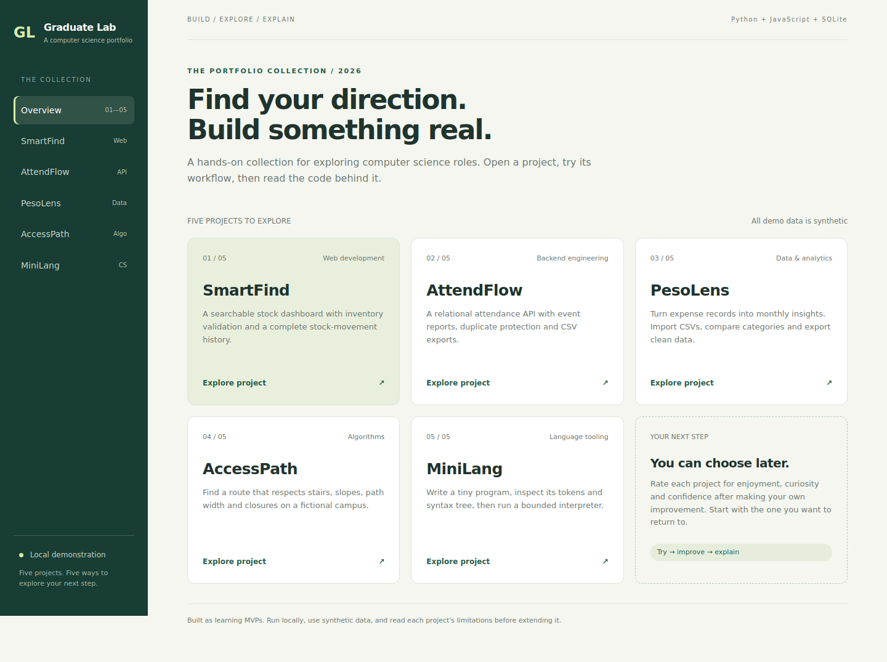

# Graduate Lab — five CS portfolio projects

An AI-assisted learning portfolio for a computer science student exploring junior developer, backend, data, QA and algorithm-focused work. Five working MVPs share a small local server and interface, while keeping their business logic and databases separate.



## Standalone repositories

Each project is also available as its own independent repository, with a dedicated dashboard, demo guide, tests, screenshots, and Codespaces setup. Clone one repository and run `python run.py`; it does not require this collection or any of the other projects.

| Project | Independent repository |
| --- | --- |
| SmartFind | [smartfind-inventory](https://github.com/itsmexavv/smartfind-inventory) |
| AttendFlow | [attendflow-attendance](https://github.com/itsmexavv/attendflow-attendance) |
| PesoLens | [pesolens-analytics](https://github.com/itsmexavv/pesolens-analytics) |
| AccessPath | [accesspath-routing](https://github.com/itsmexavv/accesspath-routing) |
| MiniLang | [minilang-workbench](https://github.com/itsmexavv/minilang-workbench) |

## The projects

| Project | What it does | Skills to explore | Project guide |
| --- | --- | --- | --- |
| **SmartFind** | Search inventory, create products, adjust stock, inspect movement history | Web UI, validation, SQLite, atomic transactions | [Read guide](projects/smartfind/README.md) |
| **AttendFlow** | Register students and events, check in/out, report absences, export CSV | Backend APIs, relational modeling, constraints, integration testing | [Read guide](projects/attendance/README.md) |
| **PesoLens** | Track income/expenses, aggregate by month/category, import/export CSV | Data cleaning, exact money, SQL aggregation, visualization | [Read guide](projects/peso/README.md) |
| **AccessPath** | Calculate shortest feasible routes with mobility preferences and closures | Graph modeling, Dijkstra, edge filtering, algorithm tests | [Read guide](projects/accesspath/README.md) |
| **MiniLang** | Tokenize, parse and interpret a small numeric language | Compiler foundations, parsing, ASTs, bounded execution | [Read guide](projects/minilang/README.md) |

All records, campus locations and measurements are synthetic. The projects are runnable learning MVPs, not production systems or evidence of commercial experience.

## Run in your browser with GitHub Codespaces

1. Open this repository on GitHub and click **Code** → **Codespaces** → **Create codespace on main**.
2. Wait for the browser editor to finish setting up. Open **Terminal** → **New Terminal** if a terminal is not already visible.
3. Run `python run.py` in that terminal.
4. Click **Open in Browser** in the port notification, or open the **Ports** tab and click the globe beside port **8000**.
5. Choose any of the five projects in the app's sidebar.

Keep port visibility **Private**. The app recognizes this Codespace's exact forwarded Host and HTTPS Origin using GitHub-provided environment variables. Other hosts and foreign origins remain rejected. Locally it continues to bind to loopback. Codespaces is a development environment, not permanent hosting; stop the Codespace after testing.

If you created a Codespace before this support was added, run `git pull` and restart `python run.py`. Forward port 8000 manually in the Ports tab if necessary. GitHub Pages cannot run this Python backend.

## Run locally

Install **Python 3.11 or newer**. No third-party Python packages, API keys or database service are needed.

Download the repository ZIP and extract it, or clone your published repository. Open a terminal inside the folder containing `run.py`:

```bash
python run.py
```

On Windows, if `python` is unavailable, use `py run.py`. On macOS/Linux, use `python3 run.py` if needed.

Open **http://127.0.0.1:8000** in your browser. Pick a project from the collection. Stop the server with Ctrl+C.

If port 8000 is busy:

```bash
python run.py --port 8001
```

The first launch creates and seeds four SQLite databases under `data/`. Changes persist after restarting. MiniLang is stateless. To start with a separate fresh data set without deleting your current data:

```bash
python run.py --data-dir demo-data --port 8001
```

Keep any custom database directory out of Git. The default `data/` directory and all `.db` files are ignored.

## Verify

```bash
python -m unittest discover -s tests -v
```

The test suite checks stock rollback and concurrent overselling, attendance uniqueness, exact monetary values, atomic CSV import, route constraints, parser precedence, execution bounds and HTTP error/security behavior. Tests use temporary databases; they do not modify your demo data. GitHub Actions runs the Python tests on 3.11, 3.12 and 3.13 when this repository is pushed.

Optional browser verification uses Node and Playwright. It is a development check, not an app dependency:

```bash
npm install --no-save playwright
npx playwright install chromium
```

In another terminal, run a server with a **fresh disposable** data directory:

```bash
python run.py --data-dir /tmp/graduate-lab-browser --port 8765
```

On Windows, use a temporary folder such as `demo-browser-data` instead of `/tmp/...`. Then run:

```bash
node tests/browser.cjs
```

Browser checks create demo records and a stock movement, test forms/routing/interpreter output, and capture desktop/mobile screenshots. Start with a new temporary data directory each time. The script defaults to port 8765; set `PORTFOLIO_URL` if using another port.

## Repository structure

| Path | Purpose |
| --- | --- |
| `run.py` | Local HTTP server, routing, JSON validation and static assets |
| `projects/<project>/__init__.py` | Each project's business logic |
| `projects/<project>/README.md` | Demo steps, APIs, design decisions and extensions |
| `shared/core.py` | Database transactions, field validation and safe CSV export |
| `web/` | Responsive interface with plain HTML, CSS and JavaScript |
| `tests/` | Business-rule tests, HTTP integration tests and browser checks |
| `docs/` | Screenshots, track exploration and interview preparation |

Read the source in this order: project guide → business logic → relevant tests → UI → server. The server dispatches `/api/<project>/...` to the project's `handle()` method. SQLite connections are opened per request, and domain modules use parameterized SQL. The UI does not inject unescaped user input into HTML.

## Make this your portfolio

These are AI-assisted baselines. Before presenting a project as your work, understand it, make your own substantive improvement, add a relevant test, and describe your contribution accurately.

1. Try each project and choose two you enjoy most.
2. Complete one extension from each chosen project guide.
3. Record a 60–90 second walkthrough showing a normal case and a failure case.
4. Write a short design note explaining a choice and a tradeoff.
5. Link your actual commits and screenshots in your resume/portfolio.

Use [track exploration](docs/CAREER_PATHS.md) to compare what you enjoy and [interview preparation](docs/INTERVIEW_GUIDE.md) to practice explaining the code.

## Scope and limitations

- The server binds to `127.0.0.1` and accepts local Host headers plus its own exact forwarded host when running in GitHub Codespaces. Keep forwarded ports private. It is intended for one-person development demos. It has no application user authentication or authorization.
- Do not expose it on the internet, use real personal records, or treat it as a deployed multi-user service. Add authentication, proper hosting, access controls and migration strategy before that use.
- The implementation uses Python's standard-library HTTP server for a small dependency-free demonstration. Python documents that server as unsuitable for production: [official HTTP server documentation](https://docs.python.org/3/library/http.server.html).
- Attendance reports show absent, present and completed, without lateness policies or event-date restrictions.
- Inventory tracks products and movements, without checkout, purchasing or billing.
- CSV imports append records and do not deduplicate them.
- AccessPath is a fictional graph with static demo measurements, not a live navigation service or an accessibility certification.
- MiniLang supports numeric variables, arithmetic, print and bounded repeat. It does not implement Python, native code generation, strings, functions or lexical scopes.

See [security and data notes](docs/SECURITY.md) for implemented protections and the remaining work.

## License

[MIT](LICENSE).
