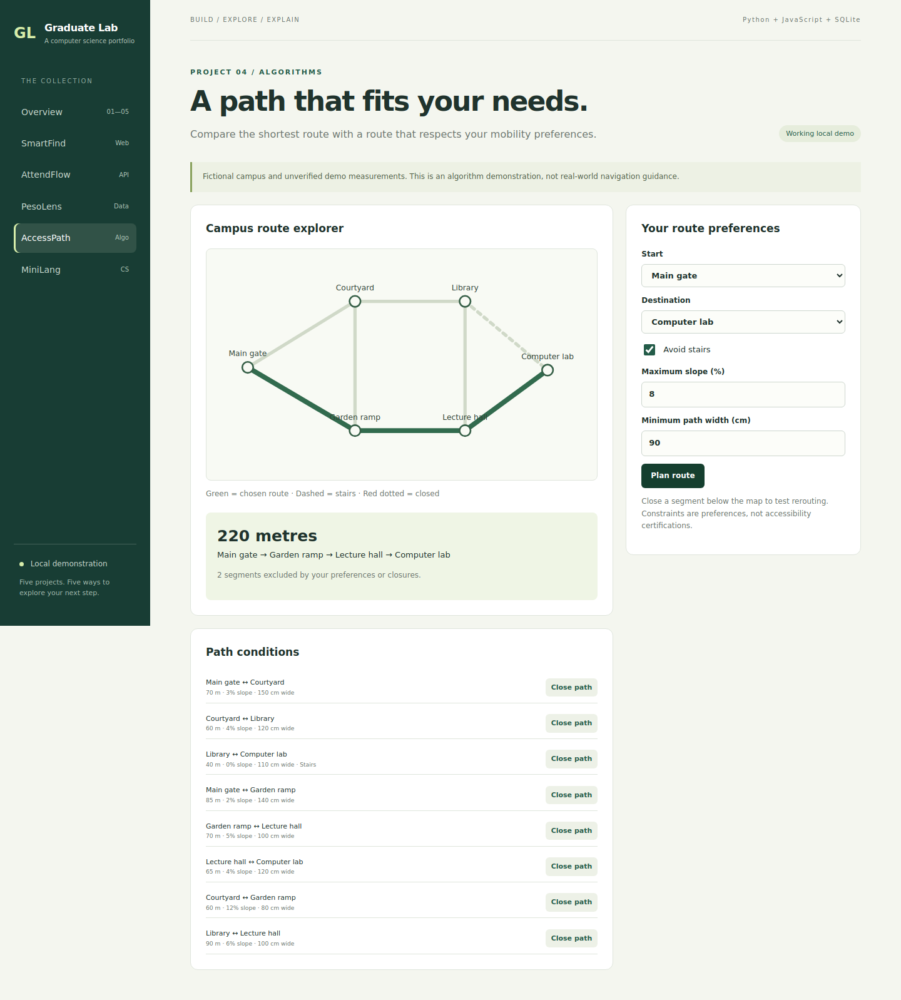

# AccessPath — constraint-aware route planner

**Explore:** graph algorithms, constraints, correctness and interactive visualization.

## Problem and workflow

The geographically shortest path may include stairs, a narrow segment or a steep slope. AccessPath filters unsuitable segments before calculating a shortest route on a fictional campus graph.

From the repository root, run `python run.py`, then open **http://127.0.0.1:8000/?app=accesspath**.

1. Plan from Main gate to Computer lab with default preferences. The route is **220 m** via Garden ramp and Lecture hall.
2. Uncheck Avoid stairs. The **170 m** route through Courtyard and Library becomes available.
3. Restore Avoid stairs and close Lecture hall ↔ Computer lab. No feasible route exists.
4. Reopen the segment and plan again.
5. Set start and destination to the same node. The route has distance zero.

All locations and measurements are invented. This is **not actual campus navigation or a certified accessibility assessment**.

## Data and algorithm

`nodes` holds ID, name and SVG coordinates. `edges` holds endpoints, distance in metres, slope percentage, width in centimetres, stairs flag and closure flag. Edges are undirected.

1. Exclude closed segments.
2. Exclude stairs if step-free is requested.
3. Exclude segments above maximum slope or below minimum width.
4. Run Dijkstra with nonnegative distance weights on the remaining graph.
5. Reconstruct the node and edge sequence using predecessors.

Time complexity is `O((V + E) log V)` for the heap-based search. The graph is deliberately small so the decisions can be inspected. An unreachable destination returns an explicit no-route result; it does not relax constraints automatically.

## API

| Method | Endpoint | Request or result |
| --- | --- | --- |
| GET | `/api/accesspath/map` | Nodes and path segments |
| POST | `/api/accesspath/plan` | `{start, end, step_free, max_slope, min_width}` |
| PATCH | `/api/accesspath/edges/6` | `{blocked: true}` or `{blocked: false}` |

Route response fields: `found`, `nodes`, `edges`, `distance`, and `excluded` with reasons. Slope range is 0–20%; width range is 50–250 cm. These are input bounds for this demo, not regulatory standards.

## Verification

Run `python -m unittest discover -s tests -v`. Tests cover the stairs shortcut, feasible route, blocked/unreachable destination, same-node path, missing nodes and invalid preferences. Browser checks verify highlighted-route output and a closure scenario.

## Extensions to make yourself

- Show per-segment exclusion reasons in the interface.
- Add graph editing with validation for disconnected nodes and invalid edges.
- Compare A* with Dijkstra using a documented admissible heuristic.
- Import a verified graph and record provenance/timestamps for every measurement before considering real navigation.

## Limits

No live map, location sensing, geocoding, verification, elevation model or route certification. Preferences are simplified hard filters. Closures persist in local SQLite. Replanning is manual after changing a closure.
