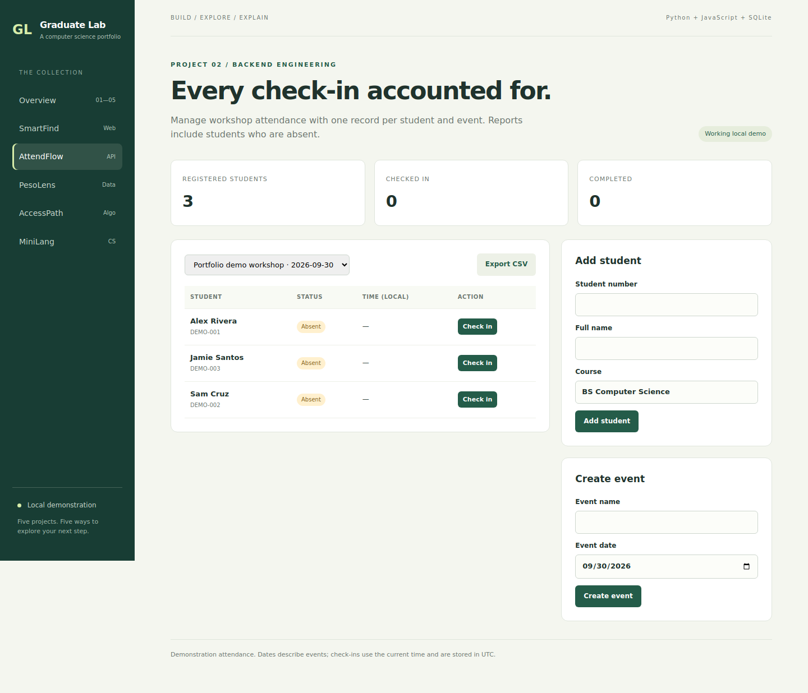

# AttendFlow — attendance API and dashboard

**Explore:** backend development, relational modeling, report queries and API testing.

## Problem and workflow

A workshop organizer needs reliable check-in/out records and a report that also includes absent students. The project registers students and events, records attendance, rejects duplicates and exports event CSVs.

From the repository root, run `python run.py`, then open **http://127.0.0.1:8000/?app=attendance**.

1. Select the seeded workshop. All demo students start as Absent.
2. Check in one student. Their status becomes Present.
3. Check out that student. Their status becomes Completed.
4. Add another event. The same student starts as Absent for that event.
5. Export CSV and inspect the absent students as well as the completed attendance.

## Data model

`students` contains unique student number, name and course. `events` contains event name and date. `attendance` references both tables and stores UTC check-in/out timestamps. `UNIQUE(student_id,event_id)` enforces one record per student/event pair.

## API

| Method | Endpoint | Request or result |
| --- | --- | --- |
| GET / POST | `/api/attendance/students` | List; create with `{student_no, name, course}` |
| GET / POST | `/api/attendance/events` | List; create with `{name, event_date}` |
| POST | `/api/attendance/check-in` | `{student_id, event_id}` |
| POST | `/api/attendance/check-out` | `{student_id, event_id}` |
| GET | `/api/attendance/records?event_id=1` | All students and their status for the selected event |
| GET | `/api/attendance/export?event_id=1` | CSV with student, course, times and status |

The API returns 409 for duplicate attendance or invalid repeated checkout, 404 for missing students/events and 400 for malformed fields. Dates use `YYYY-MM-DD`. The UI displays stored UTC timestamps in the browser's local timezone.

## Key design choices

Database uniqueness protects against concurrent duplicate requests. The report uses a `LEFT JOIN` from students to attendance, constrained by selected event, so it does not lose students without records. Checkout updates only a row that has no time-out.

## Verification

Run `python -m unittest discover -s tests -v`. Tests cover check-in/out transitions, duplicate prevention, one student across two events, missing IDs, invalid dates, absent reporting and HTTP responses. Browser checks cover the buttons and creation forms.

## Extensions to make yourself

- Define a lateness policy based on each event's start time; test exact boundary times.
- Add a separate event-registration table so events can have different rosters.
- Add safe student editing and CSV student import.
- Add authenticated organizer/student roles using a suitable framework.

## Limits

Every student is included in every event roster. No registration filtering, lateness rules, QR scanning, identity verification or date restrictions. Event date is descriptive; demo check-ins use the current time. The project contains no real student information and is for local use.
