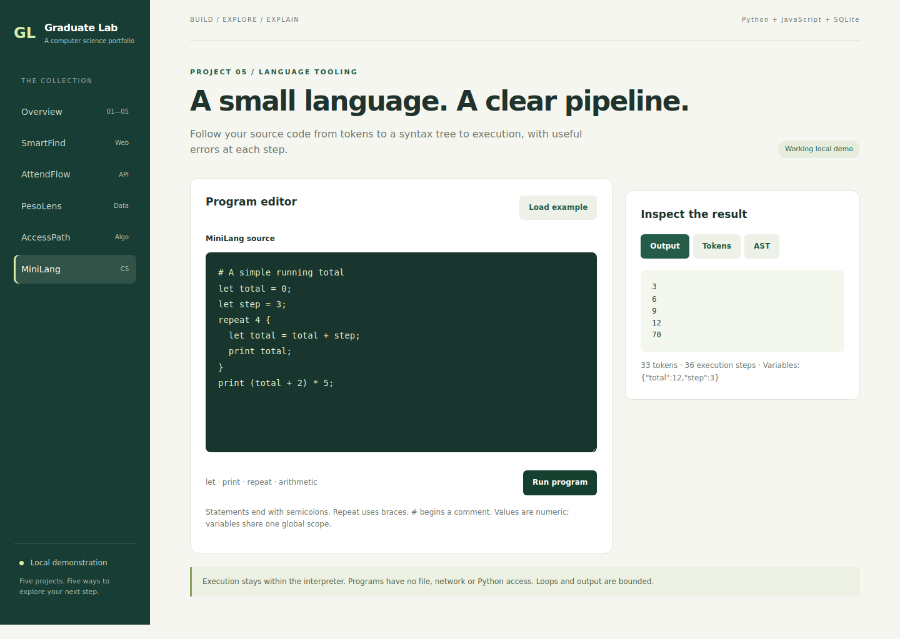

# MiniLang — language workbench

**Explore:** lexer/parser design, syntax trees, interpreter behavior and defensive execution limits.



## Problem and workflow

Programming language internals can be hard to see. MiniLang exposes tokens, a JSON AST and execution output for a small numeric language.

From the repository root, run `python run.py`, then open **http://127.0.0.1:8000/?app=minilang**.

1. Run the provided program. It prints 3, 6, 9, 12 and 70.
2. Switch between Output, Tokens and AST.
3. Try `print 2 + 3 * 4;` and inspect how the AST represents precedence.
4. Try `print 1 / 0;` to see a runtime error.
5. Remove a semicolon to see a parser error with line and column.

## Grammar

```text
program     := statement*
statement   := "let" IDENT "=" expression ";"
             | "print" expression ";"
             | "repeat" expression "{" statement* "}"
expression  := numeric expression with +, -, *, /, unary -, parentheses and variables
```

Identifiers use ASCII letters/underscore followed by letters/underscore/digits. Number literals are nonnegative integers or decimal numbers; unary minus produces negative values. `#` starts a line comment. Arithmetic follows multiplication/division before addition/subtraction, with left associativity. Variables share a single global scope; `let` assigns or reassigns. Repeat executes its body a fixed number of times, evaluated once when entered.

Example:

```text
let total = 0;
repeat 3 {
  let total = total + 2;
  print total;
}
```

## Pipeline and API

The regex lexer produces positioned tokens. The parser builds statement nodes and uses precedence climbing for arithmetic. The interpreter walks the AST with an explicit variable dictionary and output buffer. It does not call Python `eval` or `exec`.

`POST /api/minilang/run` accepts:

```json
{"source": "print 2 + 3 * 4;"}
```

The result includes `tokens`, `ast`, `output`, `variables` and `steps`. Lexing, parsing and runtime failures return 422 with a message. Lexing and parsing errors include source positions; runtime messages identify the failed rule but do not currently include positions.

## Bounds

Source: 4,000 characters. Tokens: 1,500. Repeat nesting: 20. Expression recursion: 40. Repeat count: an integer from 0 to 100. Execution budget: 10,000 counted steps. Output: 500 lines. Numeric magnitude: at most 1e12. Inputs cannot import modules or access files/network APIs.

## Verification

Run `python -m unittest discover -s tests -v`. Tests cover precedence, parentheses, left associativity, unary minus, comments, variable updates, bounded repeats, undefined variables, division by zero, missing semicolons and resource limits. Browser checks run the example and inspect the AST tab.

## Extensions to make yourself

- Add comparison tokens and expressions, including precedence tests.
- Carry source spans into AST nodes for runtime error locations.
- Add lexical scope with explicit tests for shadowing.
- Write a bytecode compiler and compare it to the tree-walk interpreter.

## Limits

This is an interpreter workbench, not a Python implementation or native compiler. No strings, functions, conditionals, input, package imports or debugging breakpoints. Decimal literals use ordinary floating-point arithmetic; this language is not intended for financial calculations.
