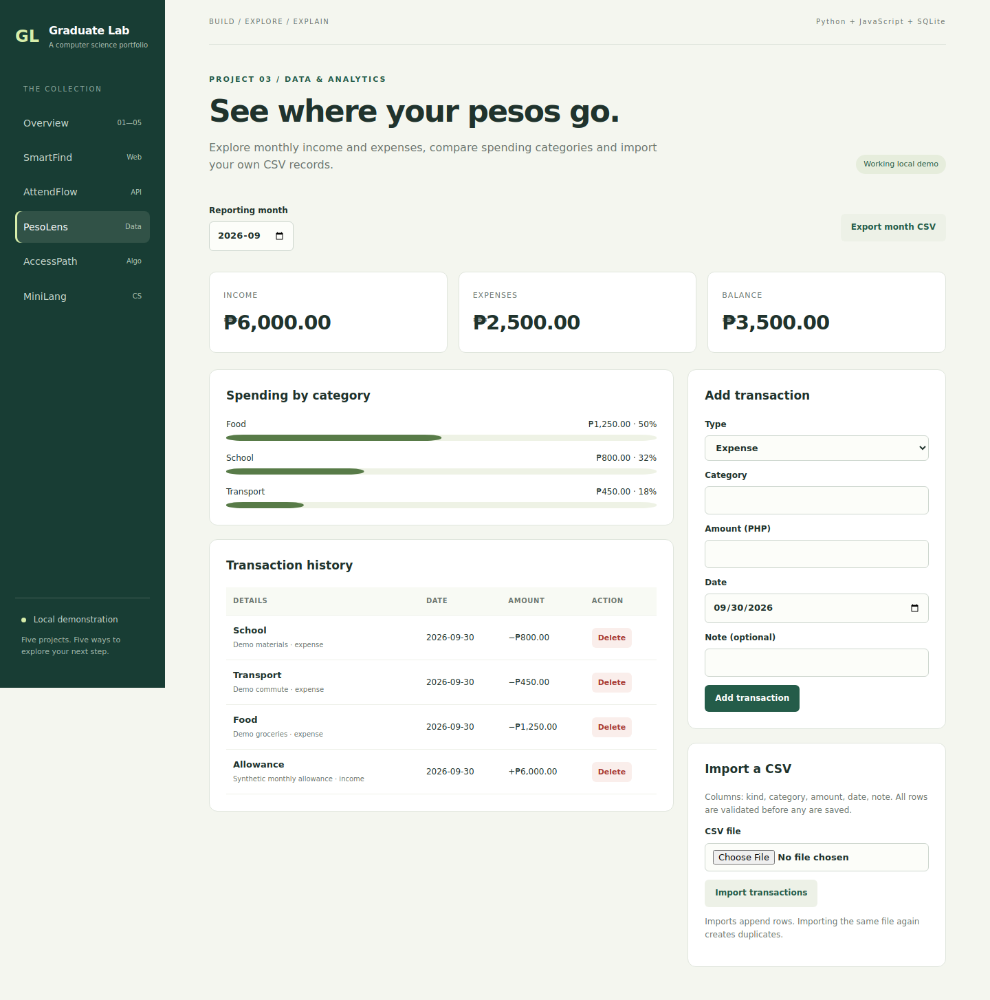

# PesoLens — expense data dashboard

**Explore:** data analysis, CSV cleaning, SQL aggregation and clear visualization.



## Problem and workflow

A student wants a simple view of monthly income and expenses without losing centavo precision. The dashboard groups expenses by category, shows totals and balance, and supports manual entry, deletion and CSV import/export.

From the repository root, run `python run.py`, then open **http://127.0.0.1:8000/?app=peso**.

1. Inspect the current month's synthetic allowance and expenses.
2. Add an expense of PHP 12.25. Observe the updated category and balance.
3. Switch to an empty month to check the zero-total behavior.
4. Import [sample.csv](sample.csv) and select January 2026 to view it.
5. Try an import with a negative amount. The entire file is rejected.
6. Export the selected month or delete a demo transaction.

## Data model and calculations

`transactions` stores income/expense kind, category, integer `amount_cents`, ISO date and note. Decimal inputs must have at most two decimal places. Monthly SQL aggregation sums integer cents; balance equals income minus expenses. Category percentages use the month's total expenses as denominator and display rounded percentages.

## CSV format

Headers must be exactly this order:

```csv
kind,category,amount,date,note
income,Allowance,6000.00,2026-01-01,Demo allowance
expense,Food,150.25,2026-01-02,"Lunch, snack"
```

The parser understands quoted fields and commas inside notes. A UTF-8 BOM is accepted. Imports append records and are **not deduplicated**. Limit: 1,000 rows and 100,000 characters per import. Text values that could become spreadsheet formulas are prefixed with an apostrophe on export.

## API

| Method | Endpoint | Request or result |
| --- | --- | --- |
| GET | `/api/peso/transactions?month=2026-01` | Transactions in selected month |
| POST | `/api/peso/transactions` | `{kind, category, amount, date, note}` |
| DELETE | `/api/peso/transactions/5` | Delete transaction 5 |
| GET | `/api/peso/summary?month=2026-01` | Income, expense, balance, category totals, all in cents |
| POST | `/api/peso/import` | `{csv: "kind,category,..."}` |
| GET | `/api/peso/export?month=2026-01` | CSV, with decimal peso amounts |

When month is omitted, the server uses its current month. No investment forecasts or financial recommendations are generated.

## Key design choice and verification

Every CSV row is validated before insertion, and the insertion runs in one transaction. A malformed file cannot create a partially imported dataset. Tests cover exact cents, month filtering, negative balances, quotes, atomic import, invalid month and spreadsheet formula neutralization.

Run `python -m unittest discover -s tests -v` from the repository root.

## Extensions to make yourself

- Add month-to-month comparisons with explicit handling for zero baselines.
- Add category normalization and an import preview.
- Add import batch IDs and duplicate detection with an explained rule.
- Build a short notebook explaining observed trends in synthetic data.

## Limits

No bank integration, currencies besides PHP, recurring transactions, budgets or accounts. Category names are free text and are grouped exactly as entered. The data is synthetic and stored locally.
