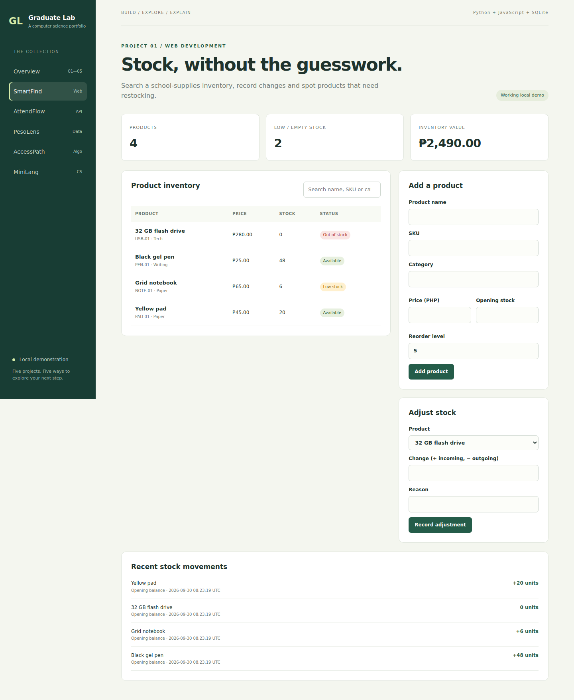

# SmartFind — inventory dashboard

**Explore:** frontend/full-stack development, transaction design and database validation.



## Problem and workflow

A small school-supplies store needs to know which products are available and why stock changed. This demo supports product creation, search, low-stock indicators, incoming/outgoing stock changes and a movement ledger.

From the repository root, run `python run.py`, then open **http://127.0.0.1:8000/?app=smartfind**.

1. Search for “notebook” and observe its low-stock status.
2. Select Grid notebook under Adjust stock and add 10 units with reason “Delivery”.
3. Check the updated stock and the new ledger entry.
4. Attempt to remove more units than are available. The API rejects the change without altering stock or the ledger.
5. Create a product, then try to reuse its SKU to see the uniqueness constraint.

## Data model

`products` stores unique SKU, name, category, price in integer cents, current stock and reorder level. `movements` references a product and stores signed quantity, reason and UTC timestamp. Products begin with an opening-balance movement.

## API

| Method | Endpoint | Request or result |
| --- | --- | --- |
| GET | `/api/smartfind/products` | Product list with computed `low_stock` flag |
| POST | `/api/smartfind/products` | `{name, sku, category, price, stock, reorder_level}` |
| POST | `/api/smartfind/adjust` | `{product_id, delta, reason}`; delta is a nonzero integer |
| GET | `/api/smartfind/movements` | Most recent 100 movements, including product name |

Example adjustment:

```json
{"product_id": 2, "delta": 10, "reason": "Demo delivery"}
```

## Key design choice

The stock read, validation, update and audit entry execute in a `BEGIN IMMEDIATE` transaction. SQLite serializes writers before the stock check, so concurrent deductions cannot both spend the same remaining units. This favors clear consistency over high write throughput for the local demo.

Price is integer cents. A SKU is unique. Stock cannot be negative. Zero-unit adjustments are rejected. The UI escapes names and reasons before rendering.

## Verification

Run `python -m unittest discover -s tests -v` from the repository root. Inventory tests cover stock rollback, ledger insertion, duplicate SKUs, parameterized SQL, persistence and concurrent overselling. Browser checks cover adding a product, searching and adjusting stock.

## Extensions to make yourself

- Add product editing without allowing stock to bypass the movement ledger.
- Add category filtering and a keyboard-accessible search workflow.
- Add supplier and purchase-order tables with foreign keys.
- Add pagination for products and movement history.

## Limits

No checkout, invoices, roles, authentication, product deletion or purchasing workflow. Search is client-side and the ledger view shows only the latest 100 entries. This is a synthetic, local MVP.
